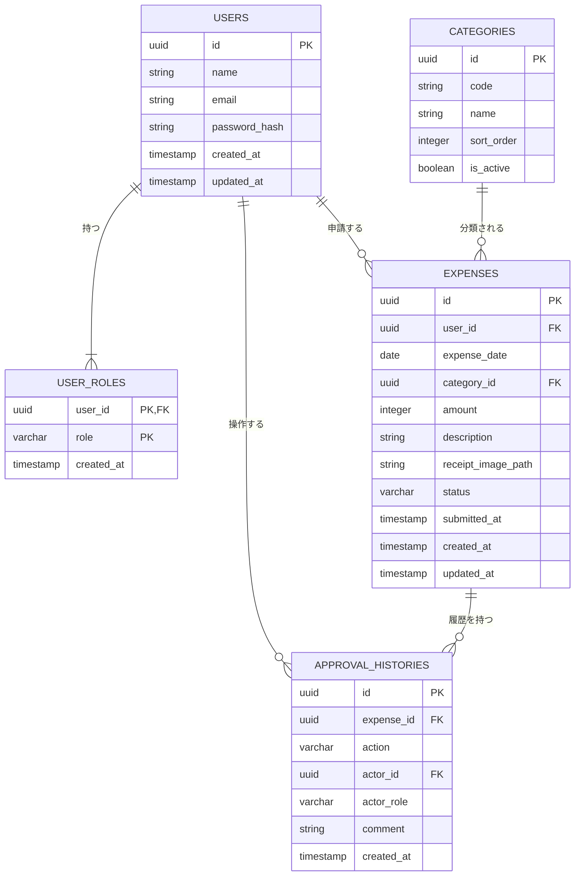

# DB設計書 — 経費精算システム

> 最終更新: 2026-04-22

---

## 1. ER図

1人のユーザーが複数のロールを持てるよう、`user_roles` テーブルを交差テーブル（紐付けテーブル）として配置しています。

---

## 2. テーブル定義

### 2.1 users (ユーザーマスタ)
ユーザーの基本情報を管理します。

| 論理名 | 物理名 | 型 | 制約 | デフォルト | 説明 |
|---|---|---|---|---|---|
| ID | `id` | `uuid` | PK | `uuid_generate_v4()` | 一意識別子 |
| 氏名 | `name` | `varchar(100)` | NOT NULL | - | ユーザーのフルネーム |
| メールアドレス | `email` | `varchar(255)` | NOT NULL, UNIQUE | - | ログインIDとして使用 |
| パスワードハッシュ | `password_hash` | `varchar(255)` | NOT NULL | - | bcrypt等でハッシュ化 |
| 作成日時 | `created_at` | `timestamp` | NOT NULL | `CURRENT_TIMESTAMP` | |
| 更新日時 | `updated_at` | `timestamp` | NOT NULL | `CURRENT_TIMESTAMP` | |

### 2.2 user_roles (ユーザーロール紐付け)
1人のユーザーが複数ロールを兼任できるよう、ユーザーとロールの関連を管理します。

| 論理名 | 物理名 | 型 | 制約 | デフォルト | 説明 |
|---|---|---|---|---|---|
| ユーザーID | `user_id` | `uuid` | PK, FK | - | `users.id` に参照 |
| ロール | `role` | `varchar(50)` | PK | - | `applicant`, `manager`, `expense_admin`, `finance_director` |
| 割り当て日時 | `created_at` | `timestamp` | NOT NULL | `CURRENT_TIMESTAMP` | |

> **補足:** `user_id` と `role` の組み合わせを複合主キー（Composite PK）とし、同一ユーザーへの重複ロール付与を防ぎます。

### 2.3 categories (勘定科目マスタ)
経費入力時に選択する勘定科目を管理します。

| 論理名 | 物理名 | 型 | 制約 | デフォルト | 説明 |
|---|---|---|---|---|---|
| ID | `id` | `uuid` | PK | `uuid_generate_v4()` | 一意識別子 |
| コード | `code` | `varchar(50)` | NOT NULL, UNIQUE | - | `transportation`等 |
| 名称 | `name` | `varchar(100)` | NOT NULL | - | 交通費など |
| 表示順 | `sort_order` | `integer` | NOT NULL | `0` | セレクトボックスでの表示順序 |
| 有効フラグ | `is_active` | `boolean` | NOT NULL | `true` | 論理削除用（過去のデータ保持のため） |

### 2.4 expenses (経費データ)
経費申請の本体データと状態（ステータス）を管理する、システムの中核テーブルです。

| 論理名 | 物理名 | 型 | 制約 | デフォルト | 説明 |
|---|---|---|---|---|---|
| ID | `id` | `uuid` | PK | `uuid_generate_v4()` | 一意識別子 |
| 申請者ID | `user_id` | `uuid` | NOT NULL, FK | - | `users.id` に参照 |
| 経費発生日 | `expense_date` | `date` | NOT NULL | - | 過去日〜当日のみ |
| 勘定科目ID | `category_id` | `uuid` | NOT NULL, FK | - | `categories.id` に参照 |
| 金額 | `amount` | `integer` | NOT NULL | - | 1〜999,999円 |
| 摘要 | `description` | `varchar(500)` | NOT NULL | - | 経費の用途や詳細 |
| 領収書パス | `receipt_image_path` | `varchar(500)` | NULL | - | ストレージ上の画像パス |
| ステータス | `status` | `varchar(50)` | NOT NULL | `'draft'` | `draft`, `pending_manager` 等 |
| 申請日時 | `submitted_at` | `timestamp` | NULL | - | 初回申請時、または再申請時に更新 |
| 作成日時 | `created_at` | `timestamp` | NOT NULL | `CURRENT_TIMESTAMP` | 下書き保存時などにセット |
| 更新日時 | `updated_at` | `timestamp` | NOT NULL | `CURRENT_TIMESTAMP` | |

### 2.5 approval_histories (承認履歴)
各経費データに対する承認、差し戻し、否認などのアクションを不変の履歴として記録します。

| 論理名 | 物理名 | 型 | 制約 | デフォルト | 説明 |
|---|---|---|---|---|---|
| ID | `id` | `uuid` | PK | `uuid_generate_v4()` | 一意識別子 |
| 経費ID | `expense_id` | `uuid` | NOT NULL, FK | - | `expenses.id` に参照 |
| アクション | `action` | `varchar(50)` | NOT NULL | - | `submit`, `approve`, `return`, `reject` |
| 操作者ID | `actor_id` | `uuid` | NOT NULL, FK | - | `users.id` に参照 |
| 操作時ロール | `actor_role` | `varchar(50)` | NOT NULL | - | 履歴の不変性担保のため、操作時点でのロールを記録 |
| コメント | `comment` | `text` | NULL | - | 差し戻し・否認時は必須 |
| 操作日時 | `created_at` | `timestamp` | NOT NULL | `CURRENT_TIMESTAMP` | |

---

## 3. インデックス設計

検索のパフォーマンスを維持するため、以下のインデックスを作成します。

1. **`expenses` テーブル**
   - `CREATE INDEX idx_expenses_user_id ON expenses(user_id);` (自分の申請一覧表示用)
   - `CREATE INDEX idx_expenses_status ON expenses(status);` (承認待ち一覧・集計用)
2. **`approval_histories` テーブル**
   - `CREATE INDEX idx_approval_histories_expense_id ON approval_histories(expense_id);` (経費詳細での履歴表示用)
