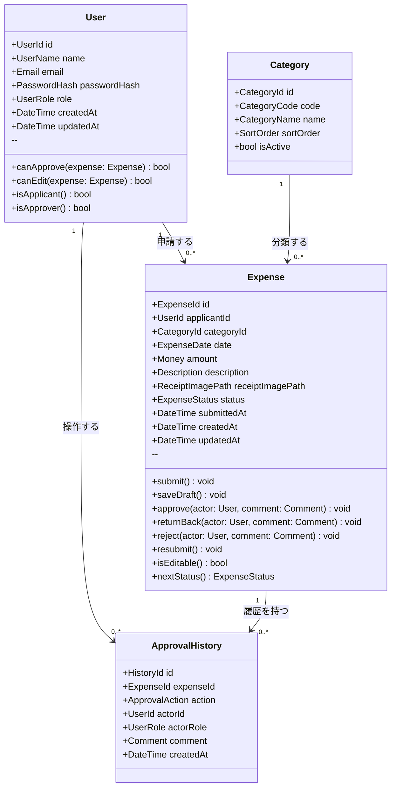
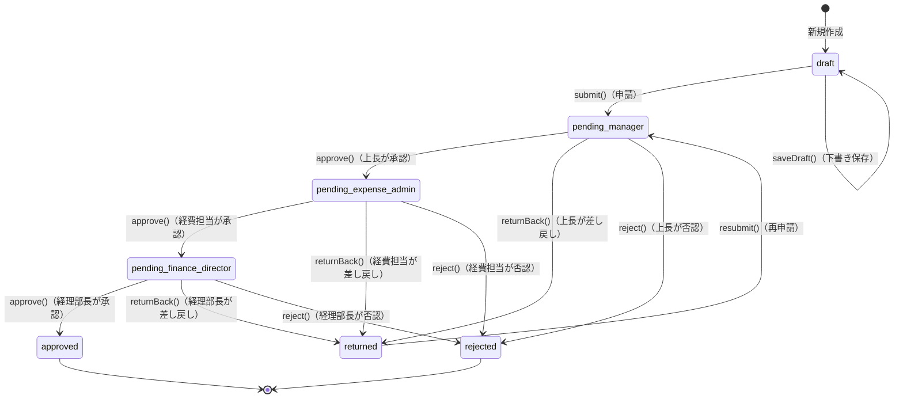

# ドメインモデル設計書 — 経費精算システム

> 最終更新: 2026-04-22

---

## 1. ドメインモデル全体図



---

## 2. エンティティ定義

### 2.1 User（ユーザー）

**概要**: システムを利用するアクター。ロールによって操作権限が異なる。

| フィールド | 型（値オブジェクト） | 制約 | 説明 |
|-----------|-------------------|------|------|
| `id` | `UserId` | NOT NULL, PK | ユーザーの一意識別子（UUID） |
| `name` | `UserName` | NOT NULL, 最大100文字 | 氏名 |
| `email` | `Email` | NOT NULL, UNIQUE | メールアドレス。ログインID |
| `passwordHash` | `PasswordHash` | NOT NULL | ハッシュ化されたパスワード |
| `role` | `UserRole` | NOT NULL | ロール（後述） |
| `createdAt` | `DateTime` | NOT NULL | 作成日時 |
| `updatedAt` | `DateTime` | NOT NULL | 更新日時 |

**ドメインルール**:
- ユーザーは必ず1つのロールを持つ（将来的に複数ロール兼任に拡張可能）
- 申請者自身は自分の申請を承認できない（BR-07）

---

### 2.2 Expense（経費申請）

**概要**: ドメインの中核となる集約ルート。経費1件を表し、ライフサイクル全体を管理する。

| フィールド | 型（値オブジェクト） | 制約 | 説明 |
|-----------|-------------------|------|------|
| `id` | `ExpenseId` | NOT NULL, PK | 経費データの一意識別子（UUID） |
| `applicantId` | `UserId` | NOT NULL, FK | 申請者ユーザーID |
| `categoryId` | `CategoryId` | NOT NULL, FK | 勘定科目ID |
| `date` | `ExpenseDate` | NOT NULL | 経費発生日（過去日〜当日） |
| `amount` | `Money` | NOT NULL | 金額（1円〜999,999円） |
| `description` | `Description` | NOT NULL, 最大500文字 | 摘要（メモ） |
| `receiptImagePath` | `ReceiptImagePath` | NULL可 | 領収書画像のファイルパス |
| `status` | `ExpenseStatus` | NOT NULL | 申請のステータス（後述） |
| `submittedAt` | `DateTime` | NULL可 | 最終申請日時（申請後にセット） |
| `createdAt` | `DateTime` | NOT NULL | 作成日時 |
| `updatedAt` | `DateTime` | NOT NULL | 更新日時 |

**集約の責務**:
- ステータス遷移の正当性を自身で保証する
- `isEditable()` で修正可能かを判定する（`draft` または `returned` のみ）
- `nextStatus()` で現在ステータスに応じた次のステータスを返す

**ドメインルール**:
- 修正可能条件: `draft` または `returned` のみ（BR-01）
- 否認後は修正・再申請不可（BR-06）
- 再申請時は `pending_manager` にリセットされる（BR-04）

---

### 2.3 ApprovalHistory（承認履歴）

**概要**: 経費申請に対して行われた全アクションの監査ログ。不変エンティティ（一度作成したら変更しない）。

| フィールド | 型（値オブジェクト） | 制約 | 説明 |
|-----------|-------------------|------|------|
| `id` | `HistoryId` | NOT NULL, PK | 履歴レコードの一意識別子（UUID） |
| `expenseId` | `ExpenseId` | NOT NULL, FK | 対象の経費ID |
| `action` | `ApprovalAction` | NOT NULL | 実行されたアクション種別（後述） |
| `actorId` | `UserId` | NOT NULL, FK | 操作者のユーザーID |
| `actorRole` | `UserRole` | NOT NULL | 操作時のロール（スナップショット） |
| `comment` | `Comment` | NULL可 | コメント（差し戻し・否認時は必須） |
| `createdAt` | `DateTime` | NOT NULL | アクション実行日時 |

**設計上の注意**:
- `actorRole` はユーザーロールの変更に影響されないよう、実行時点のロールをスナップショットとして保持する
- `comment` は差し戻し・否認時に必須（BR-02）。値オブジェクト側でバリデーション

---

### 2.4 Category（勘定科目）

**概要**: 経費の種別を表すマスタデータ。参照系集約。

| フィールド | 型（値オブジェクト） | 制約 | 説明 |
|-----------|-------------------|------|------|
| `id` | `CategoryId` | NOT NULL, PK | 勘定科目の一意識別子（UUID） |
| `code` | `CategoryCode` | NOT NULL, UNIQUE | 科目コード（例: `transportation`） |
| `name` | `CategoryName` | NOT NULL | 科目名（例: 交通費） |
| `sortOrder` | `SortOrder` | NOT NULL | 表示順 |
| `isActive` | `bool` | NOT NULL | 有効フラグ（論理削除用） |

**初期データ**:

| code | name |
|------|------|
| `transportation` | 交通費 |
| `entertainment` | 交際費 |
| `supplies` | 消耗品費 |
| `communication` | 通信費 |
| `travel` | 旅費 |
| `books` | 書籍・研修費 |
| `other` | その他 |

---

## 3. 値オブジェクト定義

| 値オブジェクト | 元の型 | バリデーション | 説明 |
|--------------|--------|-------------|------|
| `UserId` | UUID | 有効なUUID形式 | ユーザーの識別子 |
| `ExpenseId` | UUID | 有効なUUID形式 | 経費データの識別子 |
| `CategoryId` | UUID | 有効なUUID形式 | 勘定科目の識別子 |
| `HistoryId` | UUID | 有効なUUID形式 | 承認履歴の識別子 |
| `UserName` | string | 1〜100文字 | ユーザー氏名 |
| `Email` | string | RFC 5322準拠のメール形式 | メールアドレス |
| `PasswordHash` | string | bcrypt等のハッシュ形式 | ハッシュ化済みパスワード |
| `ExpenseDate` | date | 過去日〜当日 | 経費発生日 |
| `Money` | integer | 1〜999,999（円） | 経費金額 |
| `Description` | string | 1〜500文字 | 摘要・メモ |
| `ReceiptImagePath` | string | NULL可。JPEG/PNG、最大5MB | 領収書画像のパス |
| `CategoryCode` | string | 英数字のみ | 勘定科目コード |
| `CategoryName` | string | 1〜100文字 | 勘定科目名 |
| `SortOrder` | integer | 0以上 | 表示順序 |
| `Comment` | string | 差し戻し・否認時は必須 | 承認コメント |

---

## 4. 列挙型（Enum）定義

### 4.1 UserRole（ユーザーロール）

| 値 | 表示名 | 説明 |
|----|--------|------|
| `applicant` | 申請者（社員） | 経費申請を行う社員 |
| `manager` | 上長 | 第1段階の承認者 |
| `expense_admin` | 経費担当 | 第2段階の承認者 |
| `finance_director` | 経理部長 | 第3段階（最終）の承認者 |

> **補足**: 1人のユーザーが複数ロールを兼任することを将来的に許容する設計とする。

---

### 4.2 ExpenseStatus（経費ステータス）

| 値 | 表示名 | 説明 | 遷移元 | 遷移先 |
|----|--------|------|--------|--------|
| `draft` | 下書き | 入力途中。未申請 | （初期状態）/ `returned` | `pending_manager`, `draft` |
| `pending_manager` | 上長承認待ち | 上長の承認を待っている | `draft` / `returned` | `pending_expense_admin`, `returned`, `rejected` |
| `pending_expense_admin` | 経費担当承認待ち | 経費担当の承認を待っている | `pending_manager` | `pending_finance_director`, `returned`, `rejected` |
| `pending_finance_director` | 経理部長承認待ち | 経理部長の最終承認を待っている | `pending_expense_admin` | `approved`, `returned`, `rejected` |
| `returned` | 差し戻し | 申請者が修正して再申請可能 | `pending_*` | `pending_manager` |
| `rejected` | 否認 | 完全却下。再申請不可 | `pending_*` | （終端） |
| `approved` | 承認完了 | 精算処理対象 | `pending_finance_director` | （終端） |

---

### 4.3 ApprovalAction（承認アクション）

| 値 | 表示名 | コメント | 説明 |
|----|--------|---------|------|
| `submit` | 申請 / 再申請 | 不要 | 申請者が申請を提出する |
| `approve` | 承認 | 任意 | 承認者が申請を承認し次段階へ送る |
| `return` | 差し戻し | **必須** | 承認者が申請者に修正を依頼する |
| `reject` | 否認 | **必須** | 承認者が申請を完全却下する |

---

## 5. ステータス遷移図



---

## 6. 承認ロール対応表

承認段階に応じて、どのロールがどのアクションを実行できるかを定義する。

| 現在のステータス | 操作可能なロール | 承認後の次ステータス |
|----------------|---------------|---------------------|
| `pending_manager` | `manager` | `pending_expense_admin` |
| `pending_expense_admin` | `expense_admin` | `pending_finance_director` |
| `pending_finance_director` | `finance_director` | `approved` |

> **ポイント**: 各承認者は「自分の段階」の申請のみ操作できる。自己承認は禁止（BR-07）。

---

## 7. ドメインサービス定義

### 7.1 ApprovalService（承認処理サービス）

**責務**: 承認者のロール検証、ステータス遷移の実行、承認履歴の記録をまとめて行う。

**主要メソッド**:

| メソッド | 引数 | 処理内容 |
|---------|------|---------|
| `approve(actor, expense, comment)` | User, Expense, Comment | 権限チェック → ステータス遷移 → 履歴記録 |
| `returnBack(actor, expense, comment)` | User, Expense, Comment | 権限チェック → コメント必須チェック → ステータス遷移 → 履歴記録 |
| `reject(actor, expense, comment)` | User, Expense, Comment | 権限チェック → コメント必須チェック → ステータス遷移 → 履歴記録 |

**ビジネスルール適用**:
- 操作者のロールと現在のステータスが一致するか検証（BR-03）
- 申請者自身による操作でないか検証（BR-07）
- 差し戻し・否認時にコメントがあるか検証（BR-02）

---

### 7.2 ReportService（集計レポートサービス）

**責務**: 指定年月の承認済み経費データを集計する。

**主要メソッド**:

| メソッド | 引数 | 戻り値 | 処理内容 |
|---------|------|-------|---------|
| `aggregateByEmployee(year, month)` | Year, Month | `EmployeeReport[]` | 社員別 件数・合計金額を集計 |
| `aggregateByCategory(year, month)` | Year, Month | `CategoryReport[]` | 勘定科目別 件数・合計金額・構成比を集計 |

**集計対象**: `status = approved` のデータのみ（BR-05）

---

## 8. ビジネスルール一覧（ドメイン観点整理）

| ID | ルール | 適用エンティティ | 実装場所 |
|----|-------|---------------|---------|
| BR-01 | 修正可能条件: `draft` または `returned` のみ | `Expense` | `Expense#isEditable()` |
| BR-02 | 差し戻し・否認時はコメント必須 | `ApprovalHistory`, `Comment` | `ApprovalService`, `Comment` VO |
| BR-03 | 承認は上長→経費担当→経理部長の順序厳守 | `Expense`, `ApprovalService` | `ApprovalService#approve()` |
| BR-04 | 再申請時は `pending_manager` にリセット | `Expense` | `Expense#resubmit()` |
| BR-05 | 集計対象は `approved` のみ | `Expense`, `ReportService` | `ReportService` |
| BR-06 | 否認後は修正・再申請不可 | `Expense` | `Expense#isEditable()` |
| BR-07 | 申請者自身は自分の申請を承認できない | `User`, `ApprovalService` | `ApprovalService#validate()` |
| BR-08 | 金額上限: 999,999円以下 | `Money` | `Money` VO |
| BR-09 | 日付制約: 過去日〜当日のみ | `ExpenseDate` | `ExpenseDate` VO |

---

## 9. リポジトリインターフェース定義

### 9.1 UserRepository

```
interface UserRepository {
    findById(id: UserId): User | null
    findByEmail(email: Email): User | null
    save(user: User): void
}
```

### 9.2 ExpenseRepository

```
interface ExpenseRepository {
    findById(id: ExpenseId): Expense | null
    findByApplicantId(applicantId: UserId, filter: ExpenseFilter): Expense[]
    findByStatus(status: ExpenseStatus[]): Expense[]
    findApprovedByMonth(year: Year, month: Month): Expense[]
    save(expense: Expense): void
}
```

### 9.3 ApprovalHistoryRepository

```
interface ApprovalHistoryRepository {
    findByExpenseId(expenseId: ExpenseId): ApprovalHistory[]
    save(history: ApprovalHistory): void
}
```

### 9.4 CategoryRepository

```
interface CategoryRepository {
    findAll(activeOnly: bool): Category[]
    findById(id: CategoryId): Category | null
    findByCode(code: CategoryCode): Category | null
}
```

---

## 10. 関連ドキュメント

| ドキュメント | 説明 |
|------------|------|
| [プロセス設計書](./process-design.md) | 業務フロー・ユースケース・ビジネスルール詳細 |
| [画面設計書](./screen-design.md) | 画面一覧・UI要素・API エンドポイント設計 |
