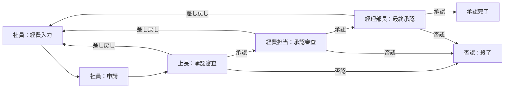
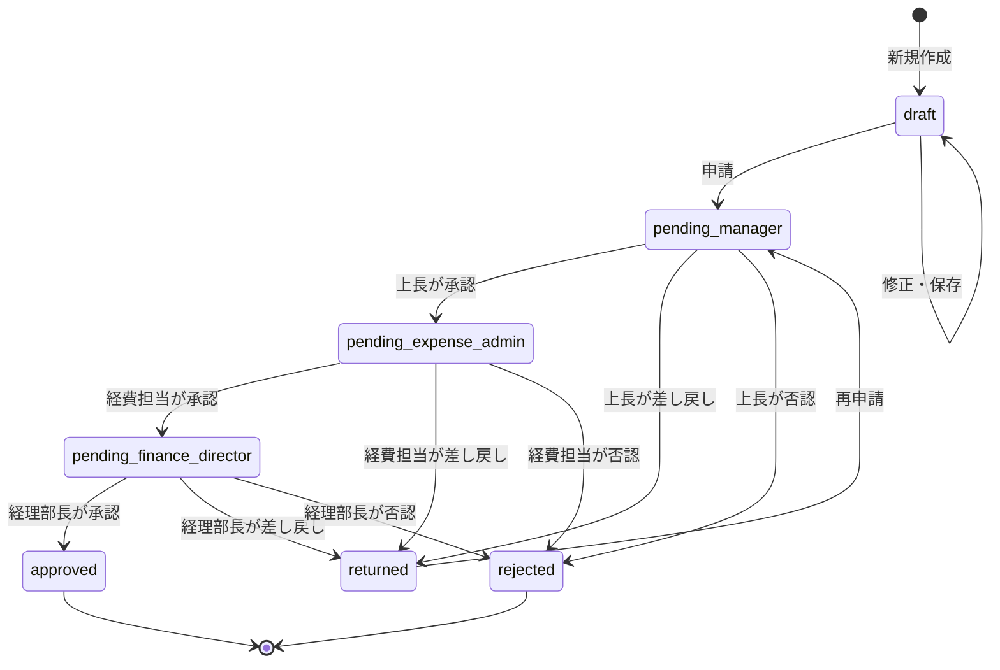

# プロセス設計書 — 経費精算システム

> 最終更新: 2026-04-22

---

## 1. 業務フロー全体像

経費精算の業務は、大きく **入力 → 申請 → 承認（3段階） → 完了** の流れで進行する。

---

## 2. アクター定義

| アクター | ロール | 権限 |
|---------|--------|------|
| 申請者（社員） | `applicant` | 経費入力・修正・申請・再申請、自分の申請一覧閲覧 |
| 上長 | `manager` | 第1段階の承認・否認・差し戻し、担当社員の申請一覧閲覧 |
| 経費担当 | `expense_admin` | 第2段階の承認・否認・差し戻し、全社員の申請一覧閲覧 |
| 経理部長 | `finance_director` | 第3段階（最終）の承認・否認・差し戻し、全社員の申請一覧閲覧、集計レポート閲覧 |

> **補足**: 1人のユーザーが複数ロールを兼任可能（例: 上長が経費担当を兼務）

---

## 3. 経費申請ステータス（状態遷移）

### 3.1 ステータス一覧

| ステータス | 値（enum） | 説明 |
|-----------|-----------|------|
| 下書き | `draft` | 入力途中。まだ申請されていない |
| 上長承認待ち | `pending_manager` | 申請済み。上長の承認を待っている |
| 経費担当承認待ち | `pending_expense_admin` | 上長が承認済み。経費担当の承認を待っている |
| 経理部長承認待ち | `pending_finance_director` | 経費担当が承認済み。経理部長の最終承認を待っている |
| 差し戻し | `returned` | いずれかの承認者が差し戻した。申請者が修正して再申請可能 |
| 否認 | `rejected` | いずれかの承認者が否認した。再申請不可 |
| 承認完了 | `approved` | 経理部長が承認。精算処理対象 |

### 3.2 状態遷移図

---

## 4. ユースケース詳細

### 4.1 UC-01: 経費データ入力

| 項目 | 内容 |
|------|------|
| アクター | 申請者（社員） |
| 事前条件 | ログイン済み |
| 事後条件 | 経費データが `draft` ステータスで保存される |

**基本フロー:**
1. 申請者が「経費入力」画面を開く
2. 以下の項目を入力する：

| フィールド | 型 | 必須 | バリデーション |
|-----------|-----|------|---------------|
| 日付 | `date` | ✅ | 過去日〜当日のみ |
| 勘定科目 | `select` | ✅ | マスタから選択 |
| 金額 | `integer` | ✅ | 1円以上、999,999円以下 |
| 摘要（メモ） | `text` | ✅ | 最大500文字 |
| 領収書画像 | `file` | ❌ | JPEG/PNG、最大5MB |

3. 「保存」ボタンで下書き保存（`draft`）
4. 「申請」ボタンで承認フローを開始（`pending_manager`）

**代替フロー:**
- **4a.** バリデーションエラー → エラーメッセージ表示、入力内容は保持

---

### 4.2 UC-02: 経費データ修正

| 項目 | 内容 |
|------|------|
| アクター | 申請者（社員） |
| 事前条件 | ステータスが `draft` または `returned` |
| 事後条件 | 経費データが更新される |

**基本フロー:**
1. 申請者が「申請一覧」から対象データを選択
2. 入力内容を修正する
3. 「保存」で下書き更新 or 「申請」で再申請

**制約:**
- `pending_*` / `approved` / `rejected` ステータスのデータは修正不可

---

### 4.3 UC-03: 承認審査

| 項目 | 内容 |
|------|------|
| アクター | 上長 / 経費担当 / 経理部長 |
| 事前条件 | 自分の承認待ちステータスの申請が存在する |
| 事後条件 | ステータスが次段階へ遷移する |

**基本フロー:**
1. 承認者が「承認待ち一覧」画面を開く
2. 対象の申請を選択し、詳細を確認する
3. 以下のいずれかのアクションを実行する：

| アクション | 次ステータス | コメント | 説明 |
|-----------|-------------|---------|------|
| 承認 | 次段階の `pending_*` or `approved` | 任意 | 次の承認者へ回す（最終承認者の場合は完了） |
| 差し戻し | `returned` | **必須** | 申請者に修正を依頼する。理由の記載が必要 |
| 否認 | `rejected` | **必須** | 申請を完全却下する。理由の記載が必要 |

**承認段階の対応表:**

| 現在のステータス | 承認者ロール | 承認時の次ステータス |
|----------------|-------------|-------------------|
| `pending_manager` | 上長 | `pending_expense_admin` |
| `pending_expense_admin` | 経費担当 | `pending_finance_director` |
| `pending_finance_director` | 経理部長 | `approved` |

---

### 4.4 UC-04: 集計レポート閲覧

| 項目 | 内容 |
|------|------|
| アクター | 経費担当 / 経理部長 |
| 事前条件 | ログイン済み、適切なロールを持つ |
| 事後条件 | なし（参照のみ） |

**基本フロー:**
1. 承認者が「集計レポート」画面を開く
2. 対象年月を選択する
3. 以下の集計データが表示される：
   - **社員別 × 月別 合計金額** の一覧テーブル
   - **勘定科目別 合計金額** の一覧テーブル
4. 集計対象は `approved`（承認完了）ステータスのデータのみ

---

## 5. 承認履歴（監査ログ）

各承認アクションは履歴として記録し、トレーサビリティを確保する。

### 承認履歴レコード構造

| フィールド | 型 | 説明 |
|-----------|-----|------|
| id | `uuid` | 履歴レコードの一意識別子 |
| expense_id | `uuid` | 対象の経費データID |
| action | `enum` | `submit` / `approve` / `return` / `reject` |
| actor_id | `uuid` | アクションを実行したユーザーID |
| actor_role | `enum` | 実行時のロール |
| comment | `text` | コメント（差し戻し・否認時は必須） |
| created_at | `timestamp` | アクション実行日時 |

---

## 6. 勘定科目マスタ

| コード | 勘定科目名 | 説明 |
|--------|-----------|------|
| `transportation` | 交通費 | 電車、バス、タクシー等 |
| `entertainment` | 交際費 | 接待、会食等 |
| `supplies` | 消耗品費 | 文具、備品等 |
| `communication` | 通信費 | 電話、郵送等 |
| `travel` | 旅費 | 出張関連費用 |
| `books` | 書籍・研修費 | 書籍購入、セミナー参加費等 |
| `other` | その他 | 上記に分類されないもの |

> **補足**: 勘定科目はマスタデータとして管理し、管理者が追加・編集可能とする（将来拡張）

---

## 7. ビジネスルール一覧

| ID | ルール | 詳細 |
|----|-------|------|
| BR-01 | 修正可能条件 | 経費データの修正は `draft` または `returned` ステータスの場合のみ |
| BR-02 | 差し戻し時コメント必須 | 差し戻し・否認時は理由コメントの入力が必須 |
| BR-03 | 承認順序の厳守 | 承認は必ず 上長 → 経費担当 → 経理部長 の順序で行う |
| BR-04 | 再申請時のリセット | 再申請時はステータスが `pending_manager`（上長承認待ち）にリセットされる |
| BR-05 | 集計対象 | 集計レポートの対象は `approved` ステータスのデータのみ |
| BR-06 | 否認後の不変性 | `rejected` ステータスのデータは修正・再申請不可 |
| BR-07 | 自己承認の禁止 | 申請者自身が承認者となることはできない |
| BR-08 | 金額上限 | 1件あたりの金額は 999,999円以下 |
| BR-09 | 日付制約 | 経費の日付は過去日〜当日のみ入力可能 |
| BR-10 | 排他制御（同時操作の防止） | 複数の承認者が同時に同じ申請を処理した場合、先に処理されたリクエストを優先し、後続はエラーとする |
| BR-11 | 不正なステータス変更の防止 | 編集不可能なステータスの経費に対して更新リクエストが来た場合、処理を拒否する |
| BR-12 | 領収書の差し替え | 差し戻し時の修正において、既存の領収書画像を削除し、新しい画像をアップロード可能とする |

---

## 8. エラーハンドリング方針と具体的なエラーメッセージ

| エラー種別 | 画面/操作 | 具体的なエラーメッセージ | 対応方針 |
|-----------|---------|-----------------------|---------|
| 認証エラー | ログイン | 「メールアドレスまたはパスワードが正しくありません。」 | 画面遷移せず、入力欄の上部に表示 |
| 必須入力エラー | 各種フォーム | 「〇〇を入力してください。」「〇〇を選択してください。」 | 対象フィールドの直下に赤字で表示。入力内容は保持 |
| 業務ルールエラー | 経費入力（日付） | 「経費発生日は本日以前の日付を選択してください。」 | 対象フィールドの直下に表示 |
| 業務ルールエラー | 経費入力（金額） | 「金額は999,999円以下で入力してください。」 「金額は1円以上で入力してください。」 | 対象フィールドの直下に表示 |
| 文字数エラー | 経費入力（摘要） | 「摘要は500文字以内で入力してください。」 | 対象フィールドの直下に表示 |
| ファイルエラー | 領収書添付 | 「ファイルサイズは5MB以下の画像を選択してください。」 「JPEGまたはPNG形式の画像を選択してください。」 | 対象フィールドの直下に表示 |
| 承認エラー | 差し戻し/否認 | 「差し戻し（否認）の理由をコメントに入力してください。」 | コメント入力欄の直下に表示 |
| 排他制御エラー | 承認操作全般 | 「この申請は既に他のユーザーによって処理されています。」 | 汎用エラーとして画面上部に表示し、一覧へ戻す |
| 権限/状態エラー | 編集画面アクセス | 「この経費データは現在編集できないステータスです。」 | 詳細画面または一覧画面へリダイレクトしてトースト表示 |
| サーバーエラー | 全般 | 「システムエラーが発生しました。時間をおいて再度お試しください。」 | 汎用エラーとして表示し、詳細はログに記録 |

