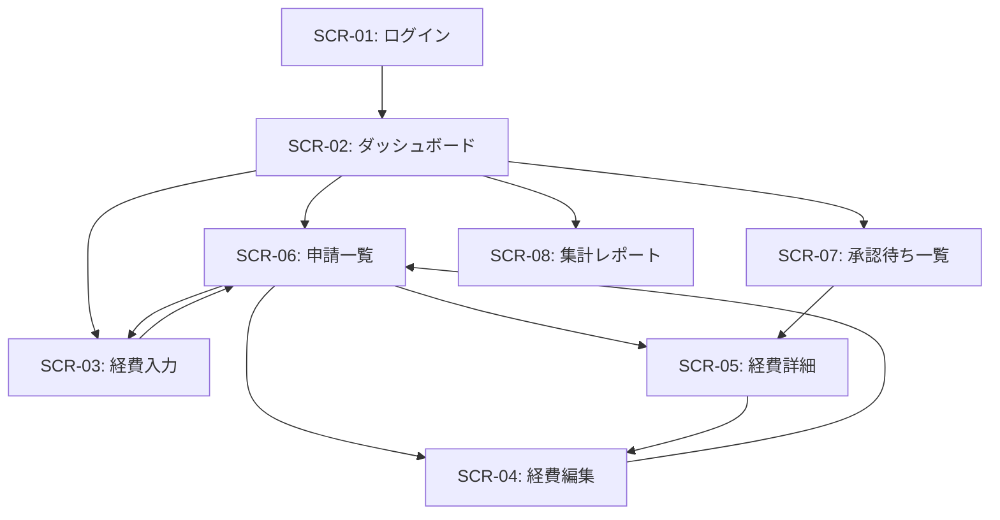
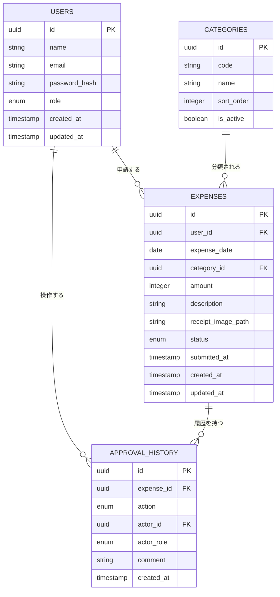

# 画面設計書 — 経費精算システム

> 最終更新: 2026-04-22

---

## 1. 画面一覧・遷移図

### 1.1 画面一覧

| ID | 画面名 | パス | アクセス権限 | 説明 |
|----|--------|------|-------------|------|
| SCR-01 | ログイン | `/login` | 全ユーザー | ログイン画面 |
| SCR-02 | ダッシュボード | `/` | 全ロール | ログイン後のホーム画面 |
| SCR-03 | 経費入力 | `/expenses/new` | `applicant` | 新規経費データ入力 |
| SCR-04 | 経費編集 | `/expenses/:id/edit` | `applicant` | 経費データ修正（draft/returned時のみ） |
| SCR-05 | 経費詳細 | `/expenses/:id` | 全ロール | 経費データの詳細表示・承認操作 |
| SCR-06 | 申請一覧（社員） | `/expenses` | `applicant` | 自分の申請一覧 |
| SCR-07 | 承認待ち一覧 | `/approvals` | `manager` `expense_admin` `finance_director` | 承認待ち申請の一覧 |
| SCR-08 | 集計レポート | `/reports` | `expense_admin` `finance_director` | 月別・勘定科目別の集計 |

### 1.2 画面遷移図



---

## 2. 共通レイアウト

### 2.1 レイアウト構造

```
┌─────────────────────────────────────────────────┐
│ ヘッダー                                         │
│  [ロゴ]  [ナビゲーション]           [ユーザー名 ▼] │
├─────────────────────────────────────────────────┤
│                                                 │
│  メインコンテンツエリア                            │
│                                                 │
│                                                 │
│                                                 │
│                                                 │
├─────────────────────────────────────────────────┤
│ フッター                                         │
└─────────────────────────────────────────────────┘
```

### 2.2 ヘッダーナビゲーション

ログインユーザーのロールに応じて表示項目を制御する。

| メニュー項目 | パス | applicant | manager | expense_admin | finance_director |
|-------------|------|-----------|---------|---------------|-----------------|
| ダッシュボード | `/` | ✅ | ✅ | ✅ | ✅ |
| 経費入力 | `/expenses/new` | ✅ | ✅ | ✅ | ❌ |
| 申請一覧 | `/expenses` | ✅ | ✅ | ✅ | ❌ |
| 承認待ち | `/approvals` | ❌ | ✅ | ✅ | ✅ |
| 集計レポート | `/reports` | ❌ | ❌ | ✅ | ✅ |

### 2.3 共通UIコンポーネント

| コンポーネント | 用途 | 仕様 |
|--------------|------|------|
| `AppHeader` | 共通ヘッダー | ロゴ、ナビ、ユーザーメニュー |
| `AppFooter` | 共通フッター | コピーライト表示 |
| `StatusBadge` | ステータス表示 | ステータスに応じた色分けバッジ |
| `ConfirmDialog` | 確認ダイアログ | 申請・承認・否認等の確認用 |
| `ErrorMessage` | エラー表示 | フィールド単位 / グローバルエラー |
| `LoadingSpinner` | ローディング | API通信中の表示 |
| `Pagination` | ページネーション | 一覧画面のページ切り替え |

### 2.4 ステータスバッジの色定義

| ステータス | 表示テキスト | 背景色 | 文字色 |
|-----------|------------|--------|--------|
| `draft` | 下書き | `#E2E8F0`（グレー） | `#4A5568` |
| `pending_manager` | 上長承認待ち | `#FEF3C7`（イエロー） | `#92400E` |
| `pending_expense_admin` | 経費担当承認待ち | `#DBEAFE`（ブルー） | `#1E40AF` |
| `pending_finance_director` | 経理部長承認待ち | `#E0E7FF`（インディゴ） | `#3730A3` |
| `returned` | 差し戻し | `#FED7AA`（オレンジ） | `#C2410C` |
| `rejected` | 否認 | `#FECACA`（レッド） | `#B91C1C` |
| `approved` | 承認完了 | `#BBF7D0`（グリーン） | `#166534` |

---

## 3. 各画面 詳細設計

---

### SCR-01: ログイン画面

**パス**: `/login`
**アクセス権限**: 未認証ユーザー

#### レイアウト

```
┌───────────────────────────────────┐
│                                   │
│        [ロゴ / システム名]          │
│        経費精算システム              │
│                                   │
│   ┌─────────────────────────┐     │
│   │ メールアドレス            │     │
│   │ [                      ]│     │
│   │                         │     │
│   │ パスワード               │     │
│   │ [                      ]│     │
│   │                         │     │
│   │    [ ログイン ]           │     │
│   └─────────────────────────┘     │
│                                   │
└───────────────────────────────────┘
```

#### UI要素

| 要素ID | 種別 | ラベル | 型 | バリデーション |
|--------|------|--------|-----|---------------|
| `login-email` | テキスト入力 | メールアドレス | `email` | 必須、メール形式 |
| `login-password` | パスワード入力 | パスワード | `password` | 必須、8文字以上 |
| `login-submit` | ボタン | ログイン | `submit` | — |

#### 動作仕様
- ログイン成功 → ダッシュボード（`/`）へリダイレクト
- ログイン失敗 → 「メールアドレスまたはパスワードが正しくありません」エラー表示
- 認証済みでアクセス → ダッシュボードへリダイレクト

---

### SCR-02: ダッシュボード

**パス**: `/`
**アクセス権限**: 全ロール（ログイン済み）

#### レイアウト

```
┌──────────────────────────────────────────────┐
│ [共通ヘッダー]                                 │
├──────────────────────────────────────────────┤
│                                              │
│  ようこそ、{ユーザー名} さん                    │
│                                              │
│  ┌──────────┐  ┌──────────┐  ┌──────────┐   │
│  │ 下書き    │  │ 承認待ち  │  │ 差し戻し  │   │
│  │   {N}件   │  │   {N}件   │  │   {N}件   │  │
│  └──────────┘  └──────────┘  └──────────┘   │
│                                              │
│  ── 最近の申請 ──────────────────────          │
│  │ 日付  │ 科目  │ 金額  │ ステータス │         │
│  │ 04/20 │ 交通費 │ ¥1,200 │ [承認待ち] │        │
│  │ 04/18 │ 交際費 │ ¥5,400 │ [下書き]   │        │
│  │ ...   │       │        │            │        │
│                                              │
│  【承認者のみ表示】                             │
│  ── 承認待ちの申請 ──────────────────           │
│  │ 申請者  │ 日付  │ 科目  │ 金額  │            │
│  │ 田中    │ 04/19 │ 旅費  │ ¥32,000 │          │
│  │ ...     │       │       │         │          │
│                                              │
├──────────────────────────────────────────────┤
│ [共通フッター]                                 │
└──────────────────────────────────────────────┘
```

#### UI要素

| 要素ID | 種別 | 説明 | 表示条件 |
|--------|------|------|---------|
| `dash-summary-draft` | サマリーカード | 下書き件数 | `applicant` |
| `dash-summary-pending` | サマリーカード | 承認待ち件数 | 全ロール |
| `dash-summary-returned` | サマリーカード | 差し戻し件数 | `applicant` |
| `dash-recent-list` | テーブル | 最近の自分の申請5件 | `applicant` |
| `dash-approval-list` | テーブル | 承認待ち申請5件 | 承認者ロール |
| `dash-btn-new` | ボタン | 新規経費入力 | `applicant` |

#### 動作仕様
- 各サマリーカードクリック → 対応するフィルター付き一覧画面へ遷移
- テーブル行クリック → 経費詳細画面（SCR-05）へ遷移
- 「新規経費入力」ボタン → 経費入力画面（SCR-03）へ遷移

---

### SCR-03: 経費入力画面

**パス**: `/expenses/new`
**アクセス権限**: `applicant`

#### レイアウト

```
┌──────────────────────────────────────────────┐
│ [共通ヘッダー]                                 │
├──────────────────────────────────────────────┤
│                                              │
│  経費入力                                     │
│                                              │
│  日付 *                                       │
│  [ 2026/04/22        📅 ]                    │
│                                              │
│  勘定科目 *                                    │
│  [ 選択してください          ▼ ]                │
│                                              │
│  金額（円） *                                   │
│  [ ¥                       ]                 │
│                                              │
│  摘要（メモ） *                                 │
│  ┌──────────────────────────┐                │
│  │                          │                │
│  │                          │                │
│  └──────────────────────────┘                │
│                        0 / 500文字            │
│                                              │
│  領収書画像（任意）                              │
│  [ ファイルを選択 ]                             │
│  ※ JPEG/PNG、最大5MB                          │
│                                              │
│  [ 下書き保存 ]    [ 申請する ]                  │
│                                              │
├──────────────────────────────────────────────┤
│ [共通フッター]                                 │
└──────────────────────────────────────────────┘
```

#### UI要素

| 要素ID | 種別 | ラベル | 型 | 必須 | バリデーション |
|--------|------|--------|-----|------|---------------|
| `expense-date` | 日付入力 | 日付 | `date` | ✅ | 過去日〜当日 |
| `expense-category` | セレクト | 勘定科目 | `select` | ✅ | マスタから選択 |
| `expense-amount` | 数値入力 | 金額（円） | `number` | ✅ | 1〜999,999 |
| `expense-description` | テキストエリア | 摘要（メモ） | `textarea` | ✅ | 1〜500文字 |
| `expense-receipt` | ファイル入力 | 領収書画像 | `file` | ❌ | JPEG/PNG、最大5MB |
| `expense-save-draft` | ボタン | 下書き保存 | `button` | — | — |
| `expense-submit` | ボタン | 申請する | `submit` | — | 確認ダイアログ表示 |

#### 動作仕様
- 「下書き保存」 → ステータス `draft` で保存、申請一覧へ遷移
- 「申請する」 → 確認ダイアログ「申請しますか？」→ はい → ステータス `pending_manager` で保存
- バリデーションエラー → 各フィールドの下にエラーメッセージ表示
- 勘定科目の選択肢はマスタデータ（`docs/process-design.md` セクション6参照）から取得

#### 勘定科目セレクトボックスの選択肢

| value | 表示テキスト |
|-------|------------|
| `transportation` | 交通費 |
| `entertainment` | 交際費 |
| `supplies` | 消耗品費 |
| `communication` | 通信費 |
| `travel` | 旅費 |
| `books` | 書籍・研修費 |
| `other` | その他 |

---

### SCR-04: 経費編集画面

**パス**: `/expenses/:id/edit`
**アクセス権限**: `applicant`（本人のデータのみ）

#### レイアウト
- SCR-03（経費入力画面）と同一レイアウト
- 既存データがフォームに事前入力される

#### 追加仕様

| 条件 | 動作 |
|------|------|
| `draft` ステータス | 通常の編集。「下書き保存」「申請する」ボタン表示 |
| `returned` ステータス | 差し戻しコメントを画面上部に表示。「修正して再申請」ボタン表示 |
| その他のステータス | 編集不可。経費詳細画面（SCR-05）へリダイレクト |

#### 差し戻し時の追加表示

```
┌─────────────────────────────────────────┐
│ ⚠️ 差し戻しコメント                       │
│ 承認者: {承認者名}（{ロール}）             │
│ 日時: 2026/04/21 14:30                  │
│ コメント: 領収書が不鮮明です。再添付を...    │
└─────────────────────────────────────────┘
```

---

### SCR-05: 経費詳細画面

**パス**: `/expenses/:id`
**アクセス権限**: 全ロール（権限に応じてアクション制御）

#### レイアウト

```
┌──────────────────────────────────────────────┐
│ [共通ヘッダー]                                 │
├──────────────────────────────────────────────┤
│                                              │
│  経費詳細                    [ステータスバッジ]  │
│                                              │
│  ┌─ 経費情報 ────────────────────────────┐    │
│  │ 申請者:     山田 太郎                   │    │
│  │ 日付:       2026/04/20                │    │
│  │ 勘定科目:   交通費                      │    │
│  │ 金額:       ¥1,200                    │    │
│  │ 摘要:       新宿→渋谷 打ち合わせ移動     │    │
│  │ 領収書:     [ 画像サムネイル 🔍 ]        │    │
│  └──────────────────────────────────────┘    │
│                                              │
│  ┌─ 承認履歴 ────────────────────────────┐    │
│  │ 2026/04/20 10:00  山田太郎   申請       │    │
│  │ 2026/04/20 15:30  佐藤課長   承認       │    │
│  │ 2026/04/21 09:00  経費担当   差し戻し    │    │
│  │   └ コメント: 日付が合ってません...       │    │
│  └──────────────────────────────────────┘    │
│                                              │
│  【承認者のみ表示】                             │
│  ┌─ 承認アクション ──────────────────────┐     │
│  │ コメント                               │     │
│  │ ┌────────────────────────────┐        │     │
│  │ │                            │        │     │
│  │ └────────────────────────────┘        │     │
│  │                                       │     │
│  │ [ 承認 ]  [ 差し戻し ]  [ 否認 ]       │     │
│  └───────────────────────────────────────┘    │
│                                              │
│  【申請者のみ: draft/returned時】              │
│  [ 編集する ]                                 │
│                                              │
├──────────────────────────────────────────────┤
│ [共通フッター]                                 │
└──────────────────────────────────────────────┘
```

#### UI要素

| 要素ID | 種別 | 説明 | 表示条件 |
|--------|------|------|---------|
| `detail-status` | StatusBadge | 現在のステータス | 常時表示 |
| `detail-info` | 情報ブロック | 経費データの全項目 | 常時表示 |
| `detail-receipt-img` | 画像 | 領収書画像（クリックで拡大） | 画像がある場合 |
| `detail-history` | タイムライン | 承認履歴の時系列表示 | 常時表示 |
| `detail-comment` | テキストエリア | 承認コメント | 承認者のみ |
| `detail-btn-approve` | ボタン（グリーン） | 承認 | 承認者 & 自分の承認待ち |
| `detail-btn-return` | ボタン（オレンジ） | 差し戻し | 承認者 & 自分の承認待ち |
| `detail-btn-reject` | ボタン（レッド） | 否認 | 承認者 & 自分の承認待ち |
| `detail-btn-edit` | ボタン | 編集する | 申請者 & `draft` or `returned` |

#### 動作仕様
- 「承認」クリック → 確認ダイアログ → ステータスを次段階へ遷移
- 「差し戻し」クリック → コメント必須チェック → 確認ダイアログ → `returned` へ
- 「否認」クリック → コメント必須チェック → 確認ダイアログ → `rejected` へ
- 「編集する」クリック → 経費編集画面（SCR-04）へ遷移
- 領収書画像クリック → モーダルで拡大表示

---

### SCR-06: 申請一覧画面（社員向け）

**パス**: `/expenses`
**アクセス権限**: `applicant`

#### レイアウト

```
┌──────────────────────────────────────────────────┐
│ [共通ヘッダー]                                     │
├──────────────────────────────────────────────────┤
│                                                  │
│  申請一覧                    [ + 新規経費入力 ]     │
│                                                  │
│  ┌─ フィルター ──────────────────────────────┐    │
│  │ ステータス: [ 全て ▼ ]   期間: [開始]〜[終了]│    │
│  └──────────────────────────────────────────┘    │
│                                                  │
│  ┌──────────────────────────────────────────┐    │
│  │ 日付    │ 勘定科目 │ 金額     │ ステータス  │    │
│  ├─────────┼─────────┼─────────┼────────────┤    │
│  │ 04/20   │ 交通費   │ ¥1,200  │ [承認待ち]  │    │
│  │ 04/18   │ 交際費   │ ¥5,400  │ [下書き]    │    │
│  │ 04/15   │ 消耗品費 │ ¥3,200  │ [承認完了]  │    │
│  │ 04/12   │ 交通費   │ ¥   980 │ [差し戻し]  │    │
│  │ ...     │         │         │            │    │
│  └──────────────────────────────────────────┘    │
│                                                  │
│  [ < 前へ ]  1 / 5  [ 次へ > ]                    │
│                                                  │
├──────────────────────────────────────────────────┤
│ [共通フッター]                                     │
└──────────────────────────────────────────────────┘
```

#### UI要素

| 要素ID | 種別 | 説明 |
|--------|------|------|
| `list-filter-status` | セレクト | ステータスフィルター（全て/各ステータス） |
| `list-filter-start` | 日付入力 | 期間フィルター（開始日） |
| `list-filter-end` | 日付入力 | 期間フィルター（終了日） |
| `list-btn-new` | ボタン | 新規経費入力へ遷移 |
| `list-table` | テーブル | 申請データの一覧 |
| `list-pagination` | ページネーション | ページ切り替え（1ページ20件） |

#### テーブルカラム定義

| カラム | フィールド | ソート | 説明 |
|--------|-----------|-------|------|
| 日付 | `date` | ✅（デフォルト降順） | 経費発生日 |
| 勘定科目 | `category` | ✅ | 勘定科目名 |
| 金額 | `amount` | ✅ | 3桁カンマ区切りで表示 |
| 摘要 | `description` | ❌ | 先頭30文字 + 省略記号 |
| ステータス | `status` | ✅ | StatusBadge で表示 |

#### 動作仕様
- テーブル行クリック → 経費詳細画面（SCR-05）へ遷移
- フィルター変更 → テーブル内容をリアルタイム絞り込み
- デフォルトソート: 日付降順（新しいものが上）

---

### SCR-07: 承認待ち一覧画面

**パス**: `/approvals`
**アクセス権限**: `manager`, `expense_admin`, `finance_director`

#### レイアウト

```
┌──────────────────────────────────────────────────────┐
│ [共通ヘッダー]                                         │
├──────────────────────────────────────────────────────┤
│                                                      │
│  承認待ち一覧                 未処理: {N}件             │
│                                                      │
│  ┌──────────────────────────────────────────────┐    │
│  │ 申請者  │ 日付    │ 勘定科目 │ 金額    │ 申請日  │    │
│  ├─────────┼────────┼─────────┼────────┼────────┤    │
│  │ 山田太郎│ 04/20  │ 交通費   │ ¥1,200 │ 04/20  │    │
│  │ 鈴木花子│ 04/19  │ 旅費    │ ¥32,000│ 04/19  │    │
│  │ ...     │        │         │        │        │    │
│  └──────────────────────────────────────────────┘    │
│                                                      │
│  [ < 前へ ]  1 / 3  [ 次へ > ]                        │
│                                                      │
├──────────────────────────────────────────────────────┤
│ [共通フッター]                                         │
└──────────────────────────────────────────────────────┘
```

#### UI要素

| 要素ID | 種別 | 説明 |
|--------|------|------|
| `approval-count` | テキスト | 未処理件数バッジ |
| `approval-table` | テーブル | 承認待ち申請の一覧 |
| `approval-pagination` | ページネーション | ページ切り替え |

#### テーブルカラム定義

| カラム | フィールド | ソート | 説明 |
|--------|-----------|-------|------|
| 申請者 | `applicant_name` | ✅ | 申請した社員名 |
| 日付 | `date` | ✅ | 経費発生日 |
| 勘定科目 | `category` | ✅ | 勘定科目名 |
| 金額 | `amount` | ✅ | 3桁カンマ区切り |
| 申請日 | `submitted_at` | ✅（デフォルト昇順） | 最初に申請/再申請された日 |

#### 表示データのフィルタリングルール

| ログインユーザーのロール | 表示対象ステータス |
|----------------------|------------------|
| `manager` | `pending_manager` |
| `expense_admin` | `pending_expense_admin` |
| `finance_director` | `pending_finance_director` |

#### 動作仕様
- テーブル行クリック → 経費詳細画面（SCR-05）へ遷移
- デフォルトソート: 申請日昇順（古いものが上＝先に処理すべきもの）

---

### SCR-08: 集計レポート画面

**パス**: `/reports`
**アクセス権限**: `expense_admin`, `finance_director`

#### レイアウト

```
┌────────────────────────────────────────────────────────┐
│ [共通ヘッダー]                                           │
├────────────────────────────────────────────────────────┤
│                                                        │
│  集計レポート                                            │
│                                                        │
│  対象年月: [ 2026年 ▼ ] [ 4月 ▼ ]                        │
│                                                        │
│  ━━ 社員別 月別合計 ━━━━━━━━━━━━━━━━━━━━━━              │
│                                                        │
│  ┌──────────────────────────────────────────────┐      │
│  │ 社員名     │ 件数  │ 合計金額                  │      │
│  ├────────────┼───────┼─────────────────────────┤      │
│  │ 山田 太郎   │  8件  │             ¥45,600     │      │
│  │ 鈴木 花子   │  5件  │             ¥28,300     │      │
│  │ 田中 一郎   │ 12件  │             ¥67,200     │      │
│  │ ...        │       │                         │      │
│  ├────────────┼───────┼─────────────────────────┤      │
│  │ 合計        │ 25件  │           ¥141,100      │      │
│  └──────────────────────────────────────────────┘      │
│                                                        │
│  ━━ 勘定科目別 合計 ━━━━━━━━━━━━━━━━━━━━━━              │
│                                                        │
│  ┌──────────────────────────────────────────────┐      │
│  │ 勘定科目     │ 件数  │ 合計金額    │ 構成比    │      │
│  ├──────────────┼───────┼────────────┼──────────┤      │
│  │ 交通費       │ 15件  │  ¥52,400   │  37.1%   │      │
│  │ 交際費       │  3件  │  ¥35,000   │  24.8%   │      │
│  │ 消耗品費     │  4件  │  ¥18,700   │  13.3%   │      │
│  │ 旅費         │  2件  │  ¥32,000   │  22.7%   │      │
│  │ その他       │  1件  │   ¥3,000   │   2.1%   │      │
│  ├──────────────┼───────┼────────────┼──────────┤      │
│  │ 合計          │ 25件  │ ¥141,100   │ 100.0%  │      │
│  └──────────────────────────────────────────────┘      │
│                                                        │
├────────────────────────────────────────────────────────┤
│ [共通フッター]                                           │
└────────────────────────────────────────────────────────┘
```

#### UI要素

| 要素ID | 種別 | 説明 |
|--------|------|------|
| `report-year` | セレクト | 対象年の選択 |
| `report-month` | セレクト | 対象月の選択 |
| `report-by-employee` | テーブル | 社員別合計テーブル |
| `report-by-category` | テーブル | 勘定科目別合計テーブル |

#### 社員別テーブルカラム定義

| カラム | 説明 | ソート |
|--------|------|-------|
| 社員名 | 社員のフルネーム | ✅ |
| 件数 | 対象月の承認済み申請件数 | ✅ |
| 合計金額 | 対象月の承認済み申請の合計金額 | ✅（デフォルト降順） |

#### 勘定科目別テーブルカラム定義

| カラム | 説明 | ソート |
|--------|------|-------|
| 勘定科目 | 勘定科目名 | ✅ |
| 件数 | 対象科目の承認済み申請件数 | ✅ |
| 合計金額 | 対象科目の承認済み申請の合計金額 | ✅（デフォルト降順） |
| 構成比 | 全体金額に占める割合（%） | ✅ |

#### 動作仕様
- 年月変更 → テーブル内容を即時更新
- 集計対象は `approved`（承認完了）ステータスのデータのみ
- 合計行はテーブル最下部に固定表示
- 件数・金額のない社員/科目は表示しない

---

## 4. レスポンシブ対応方針

| ブレークポイント | 幅 | 対応 |
|----------------|-----|------|
| デスクトップ | 1024px 以上 | 基本レイアウト |
| タブレット | 768px〜1023px | テーブルを横スクロール可能に |
| モバイル | 〜767px | ナビはハンバーガーメニュー、テーブルはカード型表示 |

> **補足**: 社内利用のため、デスクトップ表示を最優先とする。モバイル対応は Phase 2 以降で検討。

---

## 5. API エンドポイント設計（参考）

AIコーディング時の実装ガイドとして、想定されるAPIエンドポイントを記載する。

### 5.1 認証

| メソッド | パス | 説明 |
|---------|------|------|
| `POST` | `/api/auth/login` | ログイン |
| `POST` | `/api/auth/logout` | ログアウト |
| `GET` | `/api/auth/me` | ログインユーザー情報取得 |

### 5.2 経費データ

| メソッド | パス | 説明 | 権限 |
|---------|------|------|------|
| `GET` | `/api/expenses` | 経費一覧取得（フィルター・ページネーション対応） | 自分のデータ |
| `POST` | `/api/expenses` | 経費データ新規作成 | `applicant` |
| `GET` | `/api/expenses/:id` | 経費データ詳細取得 | 関係者のみ |
| `PUT` | `/api/expenses/:id` | 経費データ更新 | `applicant`（draft/returned のみ） |
| `POST` | `/api/expenses/:id/submit` | 申請 / 再申請 | `applicant` |

### 5.3 承認

| メソッド | パス | 説明 | 権限 |
|---------|------|------|------|
| `GET` | `/api/approvals` | 承認待ち一覧取得 | 承認者ロール |
| `POST` | `/api/expenses/:id/approve` | 承認 | 該当段階の承認者 |
| `POST` | `/api/expenses/:id/return` | 差し戻し（コメント必須） | 該当段階の承認者 |
| `POST` | `/api/expenses/:id/reject` | 否認（コメント必須） | 該当段階の承認者 |

### 5.4 集計

| メソッド | パス | 説明 | 権限 |
|---------|------|------|------|
| `GET` | `/api/reports/by-employee?year=2026&month=4` | 社員別月別集計 | `expense_admin` `finance_director` |
| `GET` | `/api/reports/by-category?year=2026&month=4` | 勘定科目別集計 | `expense_admin` `finance_director` |

### 5.5 マスタ

| メソッド | パス | 説明 | 権限 |
|---------|------|------|------|
| `GET` | `/api/categories` | 勘定科目マスタ一覧取得 | 全ロール |

---

## 6. データモデル概要（参考）

AIコーディング時のDB設計ガイドとして、主要エンティティの構造を記載する。

### 6.1 ER図



### 6.2 テーブル定義

#### users テーブル

| カラム | 型 | NULL | 説明 |
|--------|-----|------|------|
| id | `uuid` | NO | 主キー |
| name | `varchar(100)` | NO | 氏名 |
| email | `varchar(255)` | NO | メールアドレス（ユニーク） |
| password_hash | `varchar(255)` | NO | パスワードハッシュ |
| role | `enum('applicant','manager','expense_admin','finance_director')` | NO | ロール |
| created_at | `timestamp` | NO | 作成日時 |
| updated_at | `timestamp` | NO | 更新日時 |

#### expenses テーブル

| カラム | 型 | NULL | 説明 |
|--------|-----|------|------|
| id | `uuid` | NO | 主キー |
| user_id | `uuid` | NO | 申請者ID（FK → users.id） |
| expense_date | `date` | NO | 経費発生日 |
| category_id | `uuid` | NO | 勘定科目ID（FK → categories.id） |
| amount | `integer` | NO | 金額（円） |
| description | `varchar(500)` | NO | 摘要（メモ） |
| receipt_image_path | `varchar(500)` | YES | 領収書画像パス |
| status | `enum('draft','pending_manager','pending_expense_admin','pending_finance_director','returned','rejected','approved')` | NO | ステータス |
| submitted_at | `timestamp` | YES | 最終申請日時 |
| created_at | `timestamp` | NO | 作成日時 |
| updated_at | `timestamp` | NO | 更新日時 |

#### categories テーブル

| カラム | 型 | NULL | 説明 |
|--------|-----|------|------|
| id | `uuid` | NO | 主キー |
| code | `varchar(50)` | NO | 科目コード（ユニーク） |
| name | `varchar(100)` | NO | 科目名 |
| sort_order | `integer` | NO | 表示順 |
| is_active | `boolean` | NO | 有効フラグ |

#### approval_history テーブル

| カラム | 型 | NULL | 説明 |
|--------|-----|------|------|
| id | `uuid` | NO | 主キー |
| expense_id | `uuid` | NO | 経費ID（FK → expenses.id） |
| action | `enum('submit','approve','return','reject')` | NO | アクション種別 |
| actor_id | `uuid` | NO | 操作者ID（FK → users.id） |
| actor_role | `enum('applicant','manager','expense_admin','finance_director')` | NO | 操作時のロール |
| comment | `text` | YES | コメント（差し戻し・否認時は必須） |
| created_at | `timestamp` | NO | 操作日時 |
