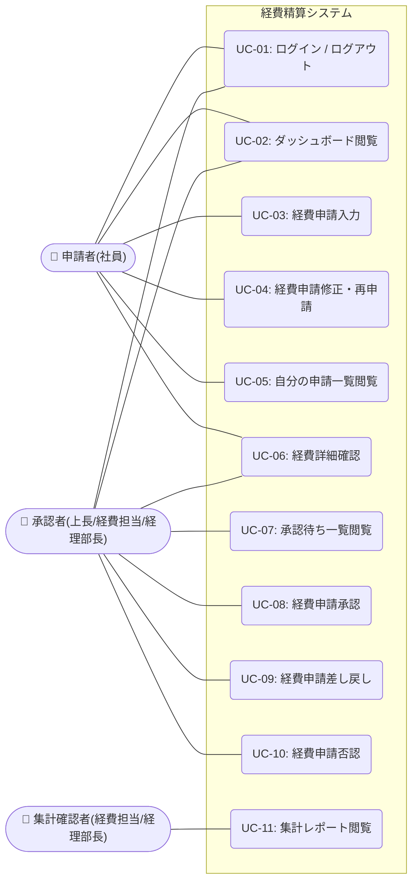

# ユースケース設計書 — 経費精算システム

> 最終更新: 2026-04-22

---

## 1. ユースケース図

システムの全体像と、各アクターが実行可能なユースケース（機能）の関連を示します。

---

## 2. ユースケース一覧

| ID | ユースケース名 | メインアクター | 概要 |
|----|--------------|-------------|------|
| **UC-01** | ログイン / ログアウト | 全ユーザー | メールアドレスとパスワードを用いてシステムへのログイン、およびログアウトを行う。 |
| **UC-02** | ダッシュボード閲覧 | 全ユーザー | 自身のステータス（下書き/承認待ち/差し戻し）の件数サマリーや、最近の申請一覧を確認する。 |
| **UC-03** | 経費申請入力 | 申請者 | 新規の経費データ（日付、金額、勘定科目、摘要、領収書）を入力し、下書き保存または申請を行う。 |
| **UC-04** | 経費申請修正・再申請 | 申請者 | ステータスが「下書き」または「差し戻し」の経費データを修正し、保存または再申請する。 |
| **UC-05** | 自分の申請一覧閲覧 | 申請者 | 自身の過去の経費申請一覧を確認し、ステータスや期間で絞り込みを行う。 |
| **UC-06** | 経費詳細確認 | 全ユーザー | 特定の経費申請の詳細情報、領収書画像、および承認履歴のタイムラインを確認する。 |
| **UC-07** | 承認待ち一覧閲覧 | 承認者 | 自身のロール（上長/経費担当/経理部長）において、承認が待たれている申請一覧を確認する。 |
| **UC-08** | 経費申請承認 | 承認者 | 承認待ちの申請内容を確認し、「承認」を行って次の段階（または完了）へ進める。 |
| **UC-09** | 経費申請差し戻し | 承認者 | 申請内容に不備がある場合、修正理由のコメントを添えて申請者に「差し戻し」を行う。 |
| **UC-10** | 経費申請否認 | 承認者 | 申請内容が規程違反などで不適切な場合、理由のコメントを添えて申請を「否認（却下）」する。 |
| **UC-11** | 集計レポート閲覧 | 経費担当、経理部長 | 月別の承認済み経費について、社員別・勘定科目別の合計金額や件数を集計したレポートを確認する。 |

---

## 3. アクターとロールの対応表

| アクター（役割） | システム上のロール | 該当するユースケース |
|---------------|-----------------|------------------|
| 申請者 | `applicant` | UC-01, 02, 03, 04, 05, 06 |
| 上長 | `manager` | UC-01, 02, 06, 07, 08, 09, 10 |
| 経費担当 | `expense_admin` | UC-01, 02, 06, 07, 08, 09, 10, 11 |
| 経理部長 | `finance_director` | UC-01, 02, 06, 07, 08, 09, 10, 11 |

> **補足:**
> システムの利用者は複数のロールを兼任する可能性があります（例：部門長が「上長」と「経理部長」を兼ねる場合など）。兼任の場合、ユーザーはそれぞれのロールに紐づくすべてのユースケースを実行可能となります。
